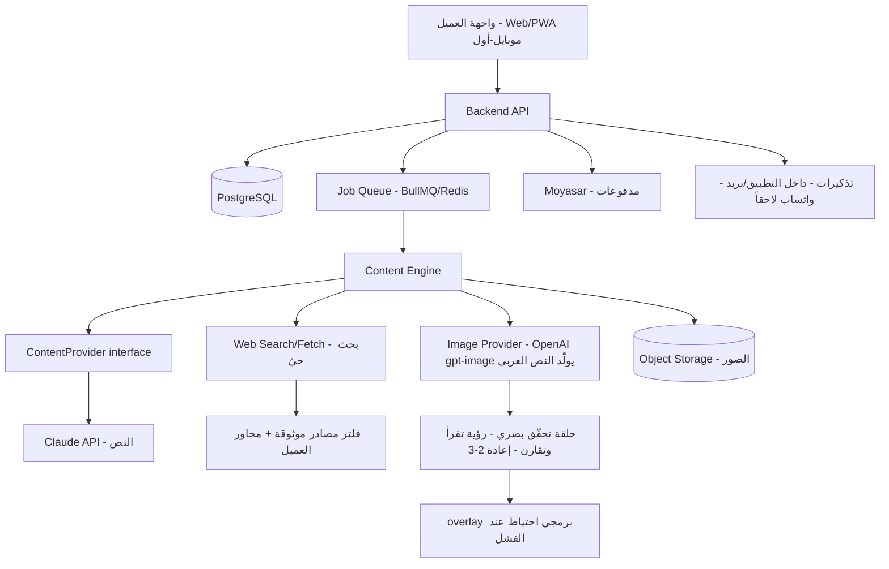
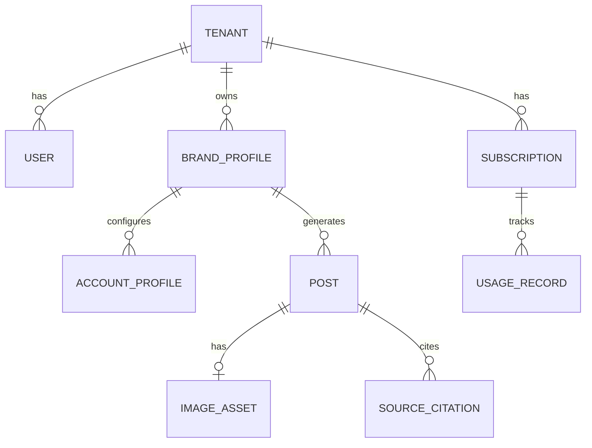

# البنية التقنية — أثر

## نظرة عامة على البنية
تطبيق ويب موبايل-أول (PWA/responsive) + Backend API + قاعدة بيانات علائقية، مع **طبقة محرّك محتوى** غير متزامنة (job queue) تتكلم مع مزوّد ذكاء خلف interface مجرّد. النشر في هذه النسخة يدوي، فلا تكاملات نشر خارجية حرجة — ما يبسّط البنية كثيراً.

## مخطط النظام

## الحزمة التقنية المقترحة (Tech Stack)
المنطق: نبني على ستاكك المثبت لتقليل المخاطرة وسرعة الإطلاق؛ ما فيه شي في هذا المنتج يبرّر الخروج عن المألوف.

| الطبقة | الاختيار | السبب |
|---|---|---|
| Frontend | Next.js (React) + RTL + خط عربي (IBM Plex Sans Arabic) | ستاكك المعتاد؛ ممتاز للـPWA وموبايل-أول ودعم RTL |
| Backend | NestJS (Node/TS) | ستاكك؛ منظّم، يدعم modules/queues بسهولة، ويتكامل مع Claude SDK |
| Database | PostgreSQL + Prisma | ستاكك؛ علائقي مناسب لـTenant/BrandProfile/Posts |
| Jobs/Queue | BullMQ + Redis | توليد "خطة شهر" غير متزامن مع تتبّع تقدّم — نمط مألوف عندك |
| Object Storage | MinIO / S3-compatible | تخزين الصور المولّدة — مألوف عندك |
| AI Engine (نص) | Claude API خلف `ContentProvider` interface | عربيته قوية، ستاكك؛ الـabstraction يتيح اختبار Jais/قلم لاحقاً |
| AI Engine (صور) | OpenAI gpt-image (مزوّد ثانٍ) | يولّد النص العربي داخل الصورة مباشرة بدل الـoverlay؛ يُدار خلف interface مجرّد مثل النص |
| Web data | بحث حيّ مقيّد بمصادر موثوقة + محاور العميل | جلب المعلومة الفعلية + المصادر (FR-5) من نطاق موثوق ضمن محاور العميل؛ بلا RAG |
| Images | gpt-image يولّد النص + تحقّق بصري + overlay احتياط | gpt-image يطبع النص العربي؛ حلقة رؤية تتحقّق وتعيد 2-3 مرات، ثم overlay برمجي كاحتياط عند الفشل |
| Payments | Moyasar | بوابة سعودية مألوفة عندك، تدعم mada/Apple Pay |
| Infra | Docker | مألوف؛ نشر per-customer أو multi-tenant حسب الحاجة |

> ملاحظة: نمط النشر محسوم — **multi-tenant منطقي (tenantId)** للإطلاق لبساطته؛ تأجيل per-customer (مثل Odoo) حتى ٣+ عملاء، تماماً كنهجك في CareKit.

## نموذج البيانات (مبدئي)

- **Tenant** (العميل/الشركة)، **User** (مستخدمو الـtenant).
- **BrandProfile**: نبرة، منتجات، جمهور، ممنوعات، منافسون، كلمات مفتاحية، **محاور/مواضيع المحتوى (topics)** — يحدّدها العميل في الـsetup وتُضاف إليها اقتراحات النظام، وتقيّد البحث الحيّ (دماغ الشركة).
- **AccountProfile**: تخصيص لكل منصة (LinkedIn/X) — بلا ربط API في هذه النسخة.
- **Post**: النص، المنصة، الحالة (`draft/pending_review/approved/published`)، موعد مقترح.
- **ImageAsset**، **SourceCitation** (مصدر كل معلومة).
- **Subscription** + **UsageRecord** (تتبّع استهلاك AI للهامش والسقوف).

## واجهات الـ API الأساسية (high level)
- **Auth/Account:** `POST /auth/register`, `POST /auth/login`, `GET /me`
- **Brand Brain:** `POST /brand/analyze` (موقع/حسابات)، `POST /brand/profile`, `GET/PATCH /brand/profile/:id`
- **Content:** `POST /posts/generate` (مفرد)، `POST /plans/generate-month` (async → jobId)، `GET /jobs/:id`
- **Posts/Calendar:** `GET /posts`, `PATCH /posts/:id` (تعديل/اعتماد)، `GET /calendar`
- **Publish (يدوي):** `GET /posts/:id/export` (نص منسّق + رابط الصورة + deep link)، `POST /posts/:id/mark-published`
- **Billing:** `POST /billing/subscribe` (Moyasar)، `GET /billing/invoice/:id`
- **Reminders:** `POST /reminders` (جدولة تذكير)

## التكاملات الخارجية
- **Claude API** — توليد النص (خلف `ContentProvider`). مفتاح API يُدار بأمان.
- **OpenAI gpt-image** — توليد الصور بالنص العربي مباشرة (مزوّد ثانٍ، خلف interface مجرّد). تمرّ كل صورة بحلقة تحقّق بصري (رؤية تقرأ وتقارن، إعادة 2-3) ثم overlay برمجي احتياطاً. مفتاح API يُدار بأمان.
- **بحث حيّ مقيّد** — بحث حيّ ضمن مصادر موثوقة فقط ومحصور في محاور العميل (BrandProfile.topics) لجلب المعلومة + المصدر (FR-5/FR-6). لا RAG.
- **Moyasar** — اشتراكات ومدفوعات (mada/Apple Pay/بطاقات)، رسوم ~٢.٧٥٪+ للمعاملة.
- **تذكيرات** — داخل التطبيق + بريد للإطلاق؛ واتساب fast-follow لاحقاً (مزوّد رسائل).
- **مؤجّل (V2):** LinkedIn Marketing Developer Platform (نشر متوافق — يحتاج موافقة شريك) و X API (pay-per-use: ~٠.٠١٥ دولار/بوست، ~٠.٢٠ للبوست بالرابط — [المصدر](https://www.getxapi.com/twitter-api-pricing)). تجنّب مصادقة الكوكيز نهائياً (سبب حظر حسابات — [المصدر](https://connectsafely.ai/articles/taplio-review-linkedin-growth-tool-2026)).

## الأمان والامتثال
- **PDPL:** موافقة صريحة عند التهيئة، تقليل البيانات (لا نخزّن إلا ما يلزم لبناء المحتوى)، حق الحذف/التصدير، وسياسة خصوصية واضحة. **ملاحظة تدفّق بيانات:** إضافة OpenAI (gpt-image) تعني تدفّق بيانات لمزوّد ثانٍ خارجي إلى جانب Claude — يجب تغطية المزوّدين في إفصاح الخصوصية والموافقة، وتقليل ما يُرسل لكلٍّ منهما.
- **بيانات العملاء/العلامات حسّاسة:** تشفير at-rest وin-transit، إدارة أسرار (vault/env آمن)، صلاحيات وفصل بيانات كل tenant.
- **الفوترة:** فاتورة اشتراك بسيطة (سجل + PDF) لكل دفعة ناجحة.
- **الأمان التحريري:** لا نشر بلا اعتماد بشري (هذه النسخة)؛ كل معلومة بمصدر؛ حارس ضد المحتوى الحسّاس ثقافياً. **الصور تمرّ بتحقّق بصري (رؤية تقرأ النص العربي وتطابقه) قبل عرضها للعميل**، مع overlay برمجي احتياطاً عند فشل التحقّق.
- **التكلفة كأمان تشغيلي:** سقوف استهلاك لكل tenant + مراقبة `UsageRecord` لمنع تآكل الهامش.
- **استضافة:** خادم/منطقة مناسبة لمتطلبات إقامة البيانات السعودية حيثما لزم.

## القرارات المعمارية (محسومة)
- **نمط الاستضافة ✓:** multi-tenant منطقي (tenantId) للإطلاق؛ تأجيل per-customer حتى ٣+ عملاء (نهج CareKit).
- **مزوّد توليد الصور ✓:** OpenAI gpt-image — يولّد النص العربي داخل الصورة، مع حلقة تحقّق بصري وoverlay احتياط.
- **آلية البحث ✓:** بحث حيّ مقيّد بمصادر موثوقة ومحاور العميل (BrandProfile.topics + اقتراحات النظام). لا RAG.
- **واتساب للتذكيرات ✓:** مؤجّل — داخل التطبيق + بريد للإطلاق، وواتساب fast-follow لاحقاً.

### ما يبقى مفتوحاً فعلاً
- **نموذج الذكاء العربي البديل:** متى/هل نختبر Jais/قلم للنص عبر الـ`ContentProvider` (قرار تكلفة/جودة)؟
